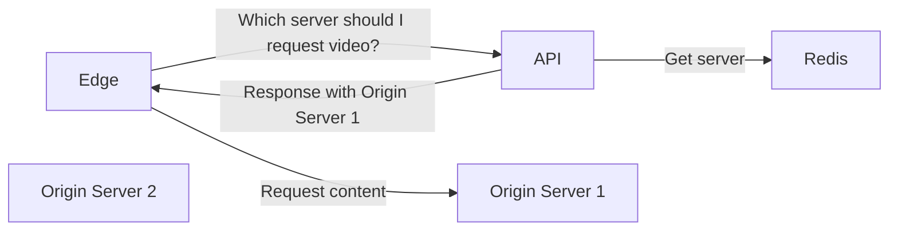

# RTMP Live

## What is this?

This repository provides a comprehensive guide and code samples for creating a small streaming platform based on the **RTMP** (Real-Time Messaging Protocol). The platform enables live streaming capabilities and leverages NGINX RTMP for receiving video streams. Additionally, the repository includes functionality to play the recorded videos via HTTP directly from another pool of servers.

Additionally, a service discovery process is included to report the active streams to an API. The API, integrated with Redis, returns the server and manifest path required for playback.

## What's the stack behind it?

This small live streaming platform relies on the the following projects:

* [`NGINX-RTMP`](https://github.com/arut/nginx-rtmp-module) - the widely, battle-tested and probably the most famous RTMP server
* [`NGINX`](https://www.nginx.com/) - the most used werb server in the world
* [`Lua`](https://www.lua.org/) - a simple yet very powerful programing language 🇧🇷
* [`Go`](https://go.dev/) - a good language to build HTTP APIs, workers, daemons and every kind of distribued system service
