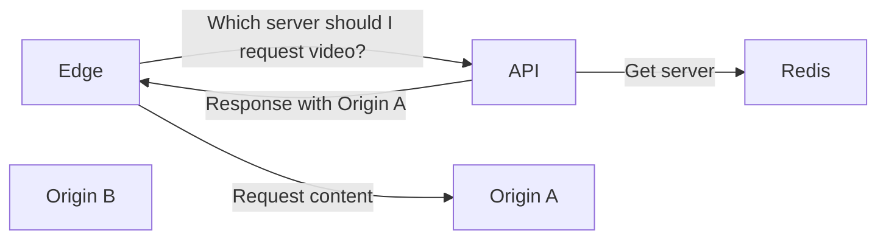
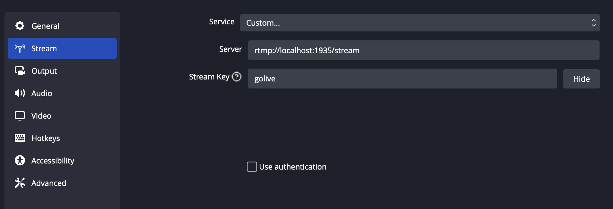
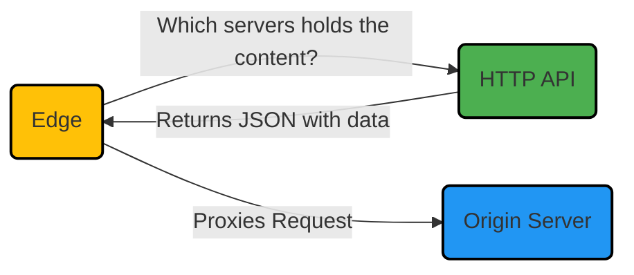
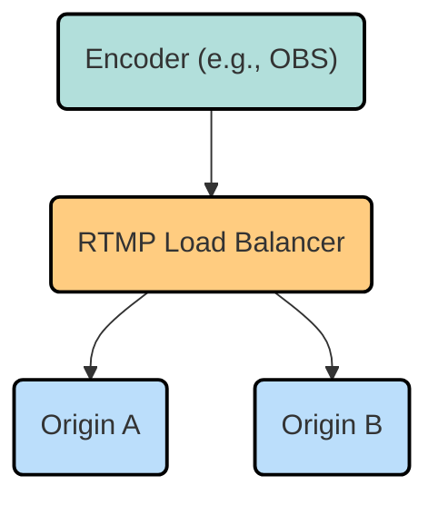
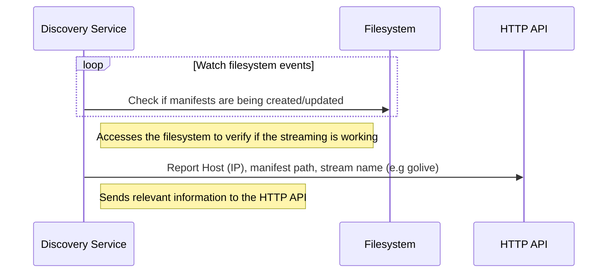

# RTMP Live

## What is this?

This repository provides a comprehensive guide and code samples for creating a small streaming platform based on the **RTMP** (Real-Time Messaging Protocol). The platform enables live streaming capabilities and leverages NGINX RTMP for receiving video streams. Additionally, the repository includes functionality to play the recorded videos via HTTP directly from another pool of servers.

Additionally, a service discovery process is included to report the active streams to an API. The API, integrated with Redis, returns the server and manifest path required for playback.



Platform components:

* Origin: ingest, storage and content origin
* Edge: CDN, server you use to play the video
* API: tracks Origin servers

## What's the stack behind it?

This small live streaming platform relies on the following projects:

* [`NGINX-RTMP`](https://github.com/arut/nginx-rtmp-module) - the widely, battle-tested and probably the most famous RTMP server
* [`NGINX`](https://www.nginx.com/) - the most used werb server in the world
* [`Lua`](https://www.lua.org/) - a simple yet very powerful programing language 🇧🇷
* [`Go`](https://go.dev/) - a good language to build HTTP APIs, workers, daemons and every kind of distribued system service

## How to use

There are some requirements you need to run this project:
* [`Docker Compose`](https://docs.docker.com/compose/)
* [`OBS Studio`](https://obsproject.com/)
* [`ffmpeg`](https://www.ffmpeg.org/)

Now you are good to go!

To use the platform, follow these steps:

1. Open your terminal and execute the command:
```docker-compose up```
2. Once all the components are up and running, launch OBS Studio on your computer.
3. Configure OBS Studio to stream via RTMP using the following settings:

```
    Stream Type: Custom Streaming Server

    URL: rtmp://localhost:1935/stream

    Stream Key: golive
```

4. Start your live streaming session in OBS Studio. The platform will now receive your live stream and make it available for playback.
5. Use a player like [VLC](https://www.videolan.org/vlc/) and point it to http://127.0.0.1:8080/golive/index.m3u8. You can also use a browser with a proper extension to play HLS.

There is also a test video that can be generated using ffmpeg:

```
ffmpeg -re -f lavfi -i "smptehdbars=rate=30:size=1920x1080" \
    -f lavfi -i "sine=frequency=1000:sample_rate=48000" \
    -vf drawtext="text='YOUR MESSAGE %{localtime\:%X}':rate=30:x=(w-tw)/2:y=(h-lh)/2:fontsize=48:fontcolor=white:box=1:boxcolor=black" \
    -f flv -c:v h264 -profile:v baseline -pix_fmt yuv420p -preset ultrafast -tune zerolatency -crf 28 -g 60 -c:a aac \
    "rtmp://localhost:1935/stream/golive"
```



*For detailed guidance on using OBS Studio, there are plenty of tutorials available on the internet. They provide comprehensive instructions and helpful tips for a smooth streaming setup.*

## Edge - CDN

The Edge server, often referred to as "the frontend server" is an essential component of the Content Delivery Network (CDN). It plays a crucial role in the media streaming platform, facilitating a seamless viewing experience for users.

It is the server delivered by the platform you are using to watch the video, this is the server your media player will use to play the video.

The Edge server serves as the intermediary between the end-users and the video content they wish to watch. When you access a video on the platform, your media player interacts with the Edge server, which efficiently delivers the video content to your device. This playable URL comes through an HTTP API and it is out of the scope of this educational project.

Our Edge component here is responsible for retrieving from an HTTP API which Origin server the content will come from, and stick to it through the playback.



A typical response from the HTTP API looks like this:

```json
{
    "name": "golive",
    "manifest": "index.m3u8",
    "host": "127.0.0.1"
}
```

We use these values in the [proxy_pass directive](https://docs.nginx.com/nginx/admin-guide/web-server/reverse-proxy/) to proxy the request to the correct origin server.


```nginx
location ~ "/(?<stream>[^/]*)/index.m3u8$" {
    set $target "";

    access_by_lua_block {
        ngx.var.target = router.fetch_streams(ngx.var.stream)
    }

    proxy_pass http://$target;
}
```

## Origin

The Origin is the component responsible for receiving the video (ingest), storing and serving the original video content to the Edge servers and users.

Keys characteristics of the Origin service are:

* Ingest: it receives the video feed from an encoder, such as [Elemental](https://aws.amazon.com/elemental-server/) or [OBS Studio](https://obsproject.com/), serving as the entry point for content upload.
* Packager: the Origin service packages the video for user consumption, fragments it into segments, and generates [HLS](https://developer.apple.com/streaming/) manifests.
* Storage: in addition to packaging, the Origin service stores all the video content.
* Delivery: as the backbone of content distribution, it acts as an upstream to the Edge servers, efficiently delivering content when requested.



### Discovery

The Discovery service is responsible for tracking and identifying which server holds a specific streaming content. This becomes especially important when multiple encoders are feeding the Origin Service with different content, and the platform needs to determine the appropriate server(s) to deliver the content when requested by users.

It is deployed aside with the Origin service. The reason is because we continuously need to know whether the video feeding is up and running.



## API

The HTTP API used by the Discovery Service performs two critical functions. Firstly, it enables real-time updates to Redis keys, ensuring the tracking of changes in streaming manifests. By utilizing TTL for Redis keys, the API automatically removes keys when the encoder goes offline or when the live streaming session ends. As a result, the platform stops offering the corresponding live content.

You can try the API using the VSCode [Rest Client](https://marketplace.visualstudio.com/items?itemName=humao.rest-client) extension. Open the [api.http file](api.http)

The API counts with three routes:

* GET [`/authorize`](http://localhost:9090/authorize) - used to authorize RTMP ingest
* POST [`/streams`](http://localhost:9090/streams) - report live streaming content
* GET [`/streams/golive`](http://localhost:9090/streams/golive) - playback information for the given stream name

## Your turn

A basic architecture has been described. And now it is your time to think about next steps for our live streaming platform:

* **Best possible experience**: aTo ensure the best possible viewer experience, explore implementing adaptive bitrate streaming. Read about [Adaptive bitrate streaming](https://en.wikipedia.org/wiki/Adaptive_bitrate_streaming)
* **Increased Resiliency**: what happens if the HTTP API goes offline for 5 minutes? How can the system handle and recover from such scenarios without compromising content availability?
* **Scalability**: to reduce latency while maintaining content delivery efficiency, explore techniques that can lower latency without reducing the segment size
